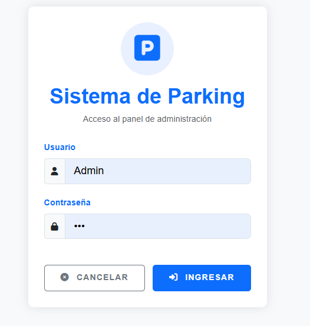
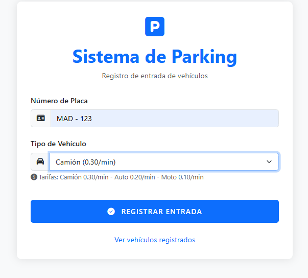
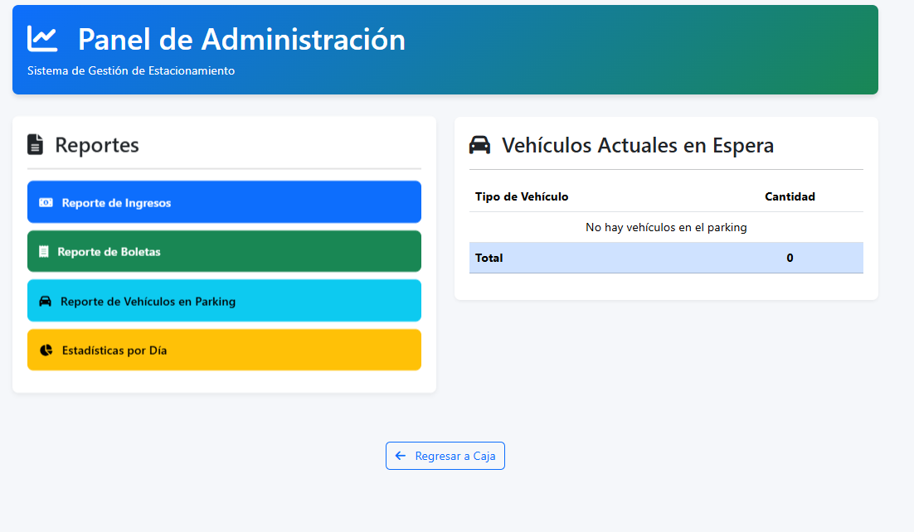
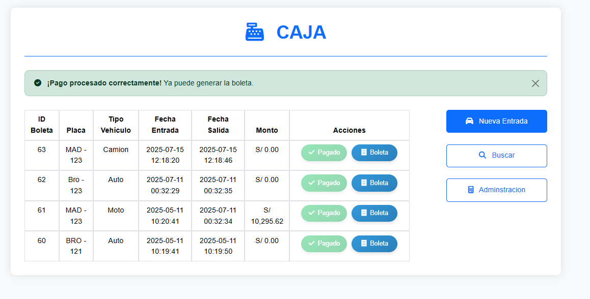
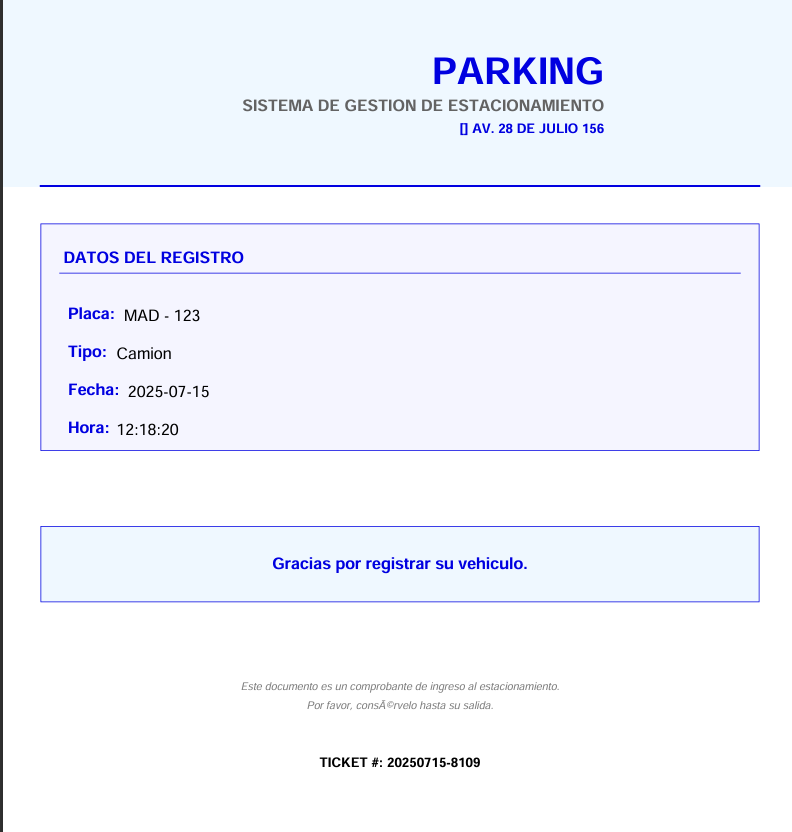

# 🚗 Sistema de Gestión de Parqueo

Sistema web desarrollado en **PHP** que permite gestionar de forma eficiente el ingreso, salida y cobro de vehículos en un estacionamiento. Incluye generación automática de boletas, control de caja, reportes financieros y un panel administrativo.

---

## 📸 Capturas de Pantalla

### 🔐 Inicio de Sesión


### 📝 Registro de Vehículos


### 📄 Reporte de Boletas


### 🛠️ Panel de Administración


### 💰 Caja y Cobros


### 🧾 Generación de Boletas


### 📈 Reporte de Ingresos


### 📊 Estadísticas Diarias


### 🚘 Vehículos en el Estacionamiento


---

## ⚙️ Tecnologías Utilizadas

- **PHP 8.x**
- **MySQL**
- **HTML5 & CSS3**
- **Bootstrap** (opcional)
- **FPDF** (para generación de PDF)
- **Git & GitHub**

---

## 🚀 Instalación

1. Clona el repositorio:

   ```bash
   git clone https://github.com/Style-1/Parking.git
